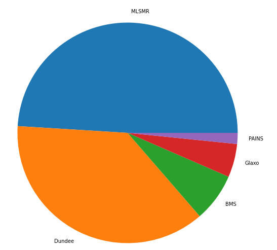

# ChemBL_api_parsing

ChemBL API documentation is located [here](https://www.ebi.ac.uk/chembl/api/data/docs) and [here](https://chembl.gitbook.io/chembl-interface-documentation/web-services/chembl-data-web-services).

## Introduction

The examples in this notebook (chembl_structural_alert_analysis.ipynb) shows how to retreive the data from ChemBL using API.

## Installation 

To use this notebook, please clone this repository. 

```bash
git clone https://github.com/nizamibilal/ChemBL_api_parsing.git
cd ChemBL_api_parsing
```

start the notebook (chembl_structural_alert_analysis.ipynb) with jupyter-lab or jupyter notebook. 

```bash
jupyter-lab chembl_structural_alert_analysis.ipynb
```

***or*** 

```bash
jupyter-notebook chembl_structural_alert_analysis.ipynb
```

## Example
Distribution of alert set.



## Contributing to the project

Questions and issues can be posted to the [issue tracker](https://github.com/nizamibilal/ChemBL_api_parsing/issues).
